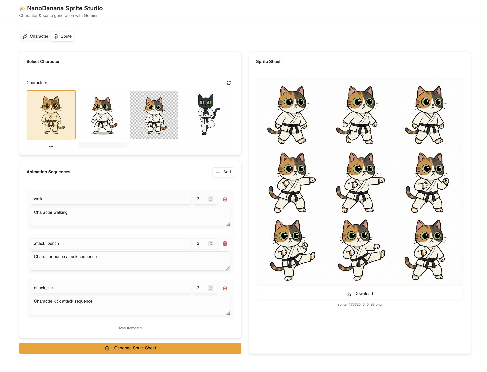

# megabananas

IDE-style application for generating and managing AI character images and animations using Gemini image models.



## Features

- **Project-based organization** — All work contained in discrete projects with hierarchical navigation
- **AI character generation** — Create characters from text prompts with configurable style presets
- **Asset provenance tracking** — Every generated image tracked with prompts, references, and settings
- **Character variations** — Generate multiple versions of a character with full lineage
- **Frame-by-frame animations** — Sequential frame generation with cumulative AI context
- **IDE three-column layout** — Left nav, tabbed workspace, context-aware action panel

## Tech Stack

- Next.js 16 (App Router)
- React 19
- TypeScript
- Tailwind CSS v4
- Prisma ORM + PostgreSQL
- Zustand (state management)
- shadcn/ui components
- @google/genai (Gemini 3 Pro)

## Data Model

```
Project
  ├── Character
  │     ├── primaryAsset (Asset)
  │     ├── variations (Asset[])
  │     └── Animation
  │           └── Frame → Asset
  └── Asset (unified storage with provenance)
```

**Asset provenance fields**: `systemPrompt`, `userPrompt`, `referenceAssetIds`, `generationSettings`

## Setup

1. Install dependencies:
```bash
bun install
```

2. Configure environment:
```bash
cp .env.example .env
# Add your credentials:
# GEMINI_API_KEY=your_key
# DATABASE_URL=postgresql://...
```

3. Initialize database:
```bash
bun run db:generate
bun run db:push
```

4. Start dev server:
```bash
bun dev
```

## Project Structure

```
app/
  api/
    projects/         CRUD for projects
    characters/       CRUD for characters
    animations/       CRUD for animations
    frames/           Frame management
    assets/           Asset storage
    gen-character/    Generate character image
    gen-sprite/       Generate sprite sheet
    edit-character/   Edit existing character

components/
  ide/
    app-layout.tsx    Three-column IDE shell
    left-sidebar.tsx  Project/character/animation nav
    right-sidebar.tsx Context-aware action forms
    workspace.tsx     Tabbed content area
    views/            Project, Character, Animation views
    forms/            New/edit forms for entities

lib/
  prisma.ts           Database client
  store.ts            Zustand global state
  gemini.ts           Gemini API helpers
  config/
    character-presets.ts  Style/angle/background options

prisma/
  schema.prisma       Data model definitions
```

## Character Generation Presets

| Category | Options |
|----------|---------|
| Style | Pixel Art, Anime, Cartoon, Realistic, Chibi, Flat Design |
| Angle | Front, 3/4 View, Side Profile, Back, Dynamic Pose |
| Background | White, Black, Gray, Green Screen |

## Scripts

| Command | Description |
|---------|-------------|
| `bun dev` | Start development server |
| `bun run build` | Production build |
| `bun run db:migrate` | Run Prisma migrations |
| `bun run db:push` | Push schema to database |
| `bun run db:studio` | Open Prisma Studio |
| `bun run lint` | Lint with Biome |
| `bun run typecheck` | TypeScript check |

## API Reference

See `REFERENCE.md` for Gemini API documentation.
